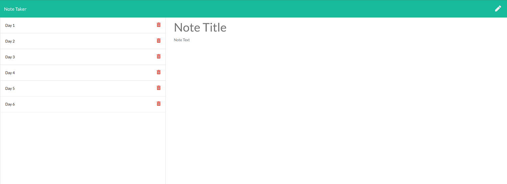

# Express.js: Note Taker

## Description
The Note Taker application was created by modifying the starter code provided (as part of my assignment for UofT SCS Coding Boot Camp Course) The application can be used to write and save notes. The application uses an Express.js back end and will save and retrieve note data from a JSON file.
The application can be used to write and save your notes; organize your thoughts and keep track of tasks you need to complete.

Technologies Used: Node.js, Express.js, JavaScript, npm, CSS Bootstrap

## Installation

1. To install this code, download the zip file and extract the files to a designated directory on your node.js server without changing the directory/folder structure, or use GitHub's guidelines to clone the repository. 
2. Once the code is extracted, navigate to the project directory and execute 'run npm install' command to install node.js and related dependencies.

## Usage 

1. The application can be invoked by using the following command:

```bash
node server.js  OR 
npm run watch
```
2. Open the URL in a browser (http://localhost:3000).

OR use a browser to point to the link for functioning application deployed on Heroku as per below.

## Screenshot of the application:


## Link to functional application deployed on Heroku:
https://salty-sea-64150.herokuapp.com/

## Credits

- The application has been developed using JavaScript, Node.js, Express.js npm. 

- Sincere thanks to my course instructors Ed (Edward Apostol), Anas (Anas Qazi) and Herman (German Arcila) for teaching and helping me in acquring HTML/CSS/JavaScript/Node.js skills. And of course thanks to my fellow students for sharing valuable tips and tricks on Slack study groups.

- Here are some websites that I referred to improve the code:
* https://www.npmjs.com/
* https://www.npmjs.com/package/express
* https://www.w3schools.com/nodejs/
* https://www.npmjs.com/package/uniqid
* https://developer.mozilla.org/en-US/docs/Web/JavaScript
* https://www.w3schools.com/js/default.asp
* https://dashboard.heroku.com/apps

## License
Licensed under the [MIT](https://choosealicense.com/licenses/mit/) license.<br>
<br />
## Feedback
Feedback is always appreciated. If you are interested in fixing any issues and contributing directly to the code base, please provide at  https://github.com/nagck/note-taker/pulls


---

